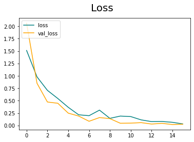
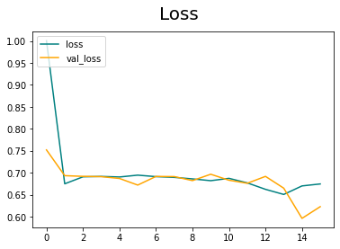

# Write a simple (supervised) deep classifier to train and test using the dataset collected in Q1.
        For this question I used 2 different dataset, I found one of them on kaggle on this endpoint:
        "https://www.kaggle.com/datasets/ciplab/real-and-fake-face-detection", I used it for fine 
        tuning and producing more real life outcome, then I created my dataset as I mentioned in 
        question_1.md.

## How will you divide your dataset into training and test sets.
        For the ready dataset: I divided data into 64 part and used 42 of them as training data, 12 
        as validation data and 10 as testin data.
        For self made dataset: I divided data into 5 part and used 3 as training data, 1 as validation
        data and 1 as testing data.

## What data-augmentation techniques will to use for out-of-distribution (unseen)images?
        I used random image rotation for training phase, for testing phase I didn't apply data-augmentation.

## Please test accuracy on the attached, rd_test_dataset zipped face images, and save the output to a .csv file.
        Results of the ready-dataset trained classifier: result_ready_data.csv
        Results of the self-made-dataset trained classifier: result_self_made_data.csv

##  Explain your accuracy scores, and add analysis based on what you proposal in Q2.
        self-made-dataset:
            training:
                loss: 0.0321 - accuracy: 0.9896 - val_loss: 0.0260 - val_accuracy: 1.0000

            testing:
                loss: 0.0056 - accuracy: 1.0000
                Precision:1.0, Recall:1.0, Accuracy:1.0

        With self-made-dataset we get 100% accuracy and really low validation loss like 2% on training. 
        This is because with small dataset it learns the data wrong, it focuses on angles, in testing 
        again it gives 100% accuracy.

        Even though we have really high accuracy both on training and testing phases, in real life we 
        will have big problems, cause of this is the small dataset. We can see the problem within the 
        result_self_made_data.csv, in the csv file all the photographs guessed as fake, I guess it is
        because of the angle of the photo. So for wider outcome we need wider datasets.

        -----------------------------------------------------------------
        ready-dataset:
            training:
                loss: 0.6744 - accuracy: 0.5781 - val_loss: 0.6227 - val_accuracy: 0.7344

            testing:
                loss: 0.6236 - accuracy: 0.6250
                Precision:0.3333333432674408, Recall:0.5, Accuracy:0.625

        We can see that even though the validation accuracy and validation loss is not perfect, it is
        within an acceptable limit, the validation accuracy is higher than training accuracy probably 
        because of data augmentation. On testing phase, we achieved 62.5% accuracy, again I say it is
        within an acceptable limit because the data set was really small(200 images). But also the
        dataset have more related photos to challenge-given-dataset, the predicitons in result_ready_data.csv
        are more consistent and reliable.